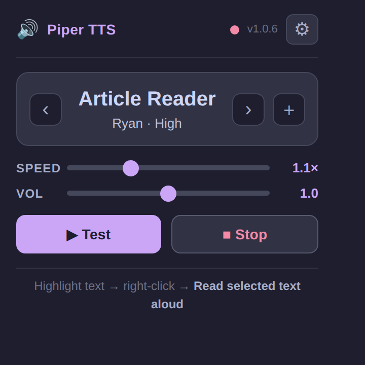
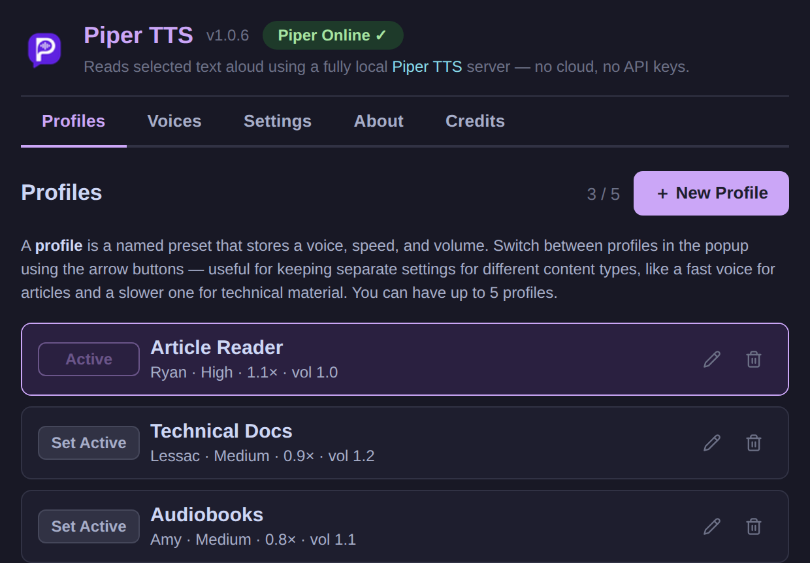
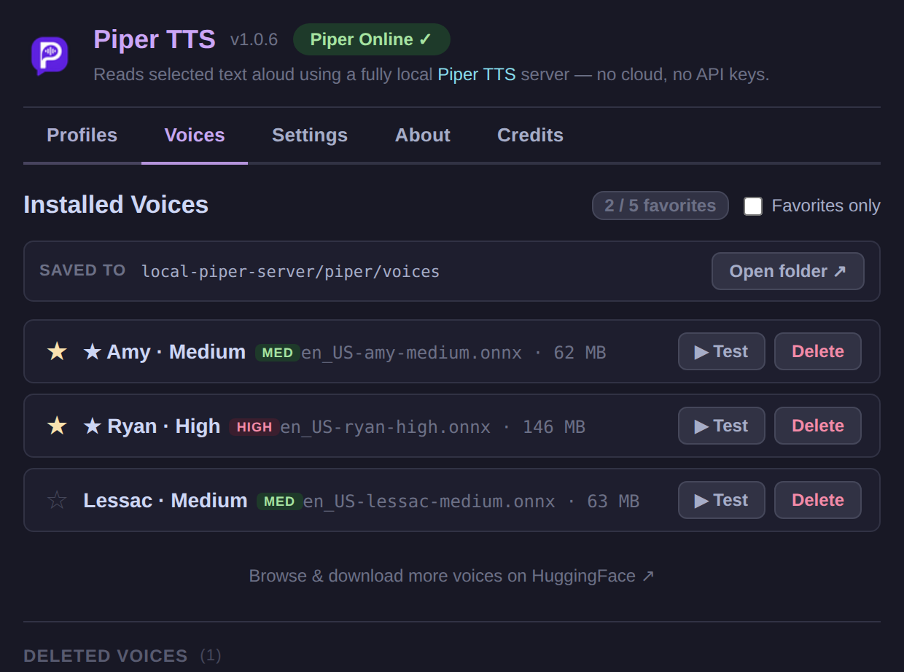
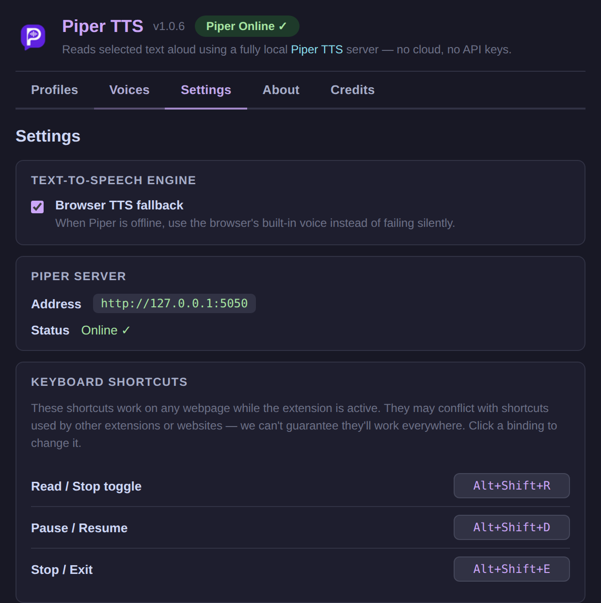
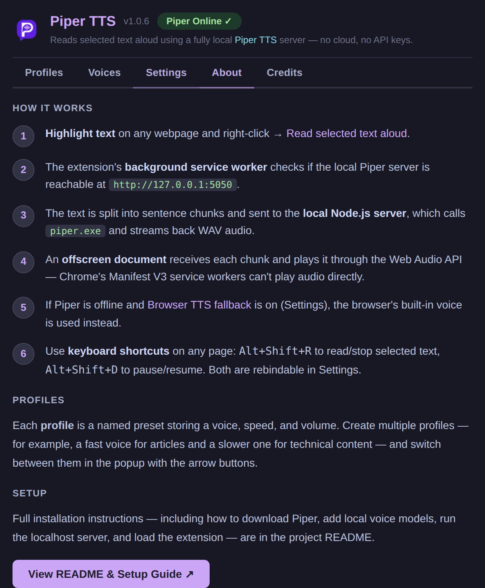
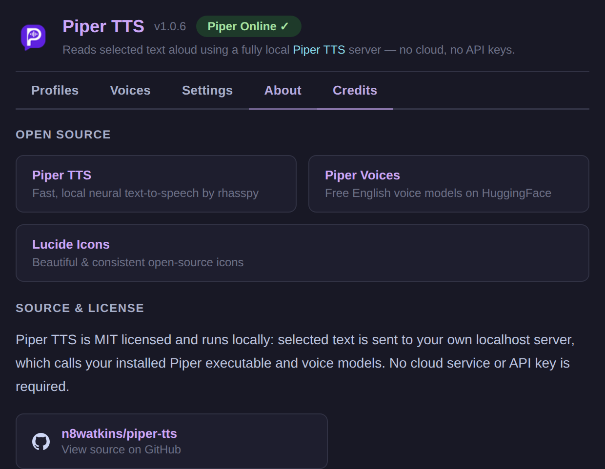

# Piper TTS

A Chrome extension that lets you highlight text on any webpage, right-click it, and have it read aloud using a fully local [Piper TTS](https://github.com/rhasspy/piper) model running on your machine — no cloud, no API keys, no data leaves your computer.

A browser TTS fallback is also built in, so it works instantly with no server setup. The popup and options page are built with React and bundled into the extension.


## Screenshots



### Options Views











Regenerate these images from WSL with Windows Chrome. The script follows the same pattern used by TubeVault: it serves the extension UI locally, starts Windows Chrome with remote debugging, drives it with Puppeteer, and writes the popup plus every options tab to `screenshots/`.

```bash
npm install
npm run screenshots
```

If your Windows account, Chrome path, or Windows Node path differs from the defaults, set these before running the script:

```bash
PIPER_TTS_WINDOWS_USER=your-windows-user npm run screenshots
PIPER_TTS_CHROME_PATH='C:\Program Files\Google\Chrome\Application\chrome.exe' npm run screenshots
PIPER_TTS_WINDOWS_NODE='/mnt/c/Program Files/nodejs/node.exe' npm run screenshots
```

---

## What's in this repo

```
piper-tts/
├── package.json             React UI build + test + screenshot scripts
├── tools/                   esbuild, test, and Puppeteer helpers
│   └── hooks/               Git pre-commit hook (keeps dist in sync with src)
├── test/                    Unit tests for shared UI helpers (node --test)
├── extension/              Chrome Manifest V3 extension
│   ├── manifest.json
│   ├── background.js       Service worker: context menu, routing
│   ├── offscreen.html/.js  Hidden page that plays Piper audio (MV3 requirement)
│   ├── src/                React source for popup and options
│   ├── dist/               Built React bundles loaded by Chrome
│   ├── popup.html/.css     Toolbar popup shell + styles
│   ├── options.html/.css   Full settings page shell + styles
│   └── icons/
│
└── local-piper-server/     Local Node.js server that calls Piper
    ├── server.js
    ├── package.json
    ├── piper/
    │   ├── piper(.exe)     ← you download this (see Step 3)
    │   └── voices/
    │       ├── *.onnx      ← you download these (see Step 4)
    │       └── *.onnx.json
    └── output/             Temp WAV files (auto-cleaned)
```

---

## Development

```bash
npm install     # installs deps and enables the git hooks (see below)
npm run build   # bundle extension/src → extension/dist
npm test        # unit tests: shared UI helpers + the module service worker loads
npm run version:patch   # bump the extension version (also :minor / :major)
```

Bumping the version keeps `extension/manifest.json`, `package.json`, and
`package-lock.json` in lockstep (the value Chrome shows for the loaded
extension). Add `--dry` to preview without writing:
`node tools/bump-version.mjs minor --dry`. The `local-piper-server` is versioned
independently and is not touched.

The committed `extension/dist` bundles must always match `extension/src`. A
tracked pre-commit hook (`tools/hooks/pre-commit`) rebuilds and re-stages them
whenever a commit touches the UI sources or build tooling, so a forgotten
`npm run build` can't ship a stale bundle. `npm install` enables it via the
`prepare` script; to enable it manually run:

```bash
git config core.hooksPath tools/hooks
```

---

## Setup Guide

### Step 1 — Clone or download this repo

```bash
git clone https://github.com/n8watkins/piper-tts.git
cd piper-tts
```

Or download the ZIP from GitHub and extract it.

---

### Step 2 — Load the Chrome extension

1. Open Chrome and navigate to: `chrome://extensions`
2. Enable **Developer mode** (toggle in the top-right corner)
3. Click **Load unpacked**
4. Select the **`extension/`** folder inside this project

You'll see the Piper TTS icon appear in your Chrome toolbar.

> **You can stop here** and the extension will work right now using your browser's built-in voice. To get high-quality local neural TTS, continue with steps 3–6.

The repo includes the built React files under `extension/dist/`, so you do not need a build step just to load the extension. If you edit `extension/src/`, rebuild the popup and options bundles from the repo root:

```bash
npm install
npm run build
```

---

### Step 3 — Download Piper TTS

Piper is a fast, offline text-to-speech engine. Download the build for your OS:

1. Go to the [Piper releases page](https://github.com/rhasspy/piper/releases/latest)
2. Download the appropriate archive, such as `piper_windows_amd64.zip`
3. Extract it — you'll get a folder containing the Piper executable and support files
4. Copy **all** the extracted files into:
   ```
   local-piper-server/piper/
   ```

On Windows, your folder should look like:
```
local-piper-server/piper/
├── piper.exe
├── espeak-ng-data/     (comes with the Piper archive)
└── ...other DLLs
```

On macOS/Linux, the executable is usually named `piper`. Put it at `local-piper-server/piper/piper`, or set `PIPER_BIN` to the executable path when starting the server.

---

### Step 4 — Download a voice model

Piper uses `.onnx` voice model files. Each voice has two files: a `.onnx` model and a `.onnx.json` config.

1. Go to the [Piper voices on HuggingFace](https://huggingface.co/rhasspy/piper-voices/tree/main/en/en_US)
2. Browse and find a voice you like (e.g. `en_US-ryan-high` or `en_US-amy-medium`)
3. Download **both** files for your chosen voice:
   - `en_US-ryan-high.onnx`
   - `en_US-ryan-high.onnx.json`
4. Place both files in:
   ```
   local-piper-server/piper/voices/
   ```

You can download multiple voices and switch between them in the extension's Settings page.

### Adding voices

1. Download both files for each voice:
   - `voice-name.onnx`
   - `voice-name.onnx.json`
2. Put both files in:
   ```
   local-piper-server/piper/voices/
   ```
3. Start or restart the local server with `npm start`.
4. Open the extension Settings page and go to **Voices**.
5. Use **Test** to preview a voice, star favorites, or delete voices you no longer want.

The **Open folder** button in the Voices tab opens the exact folder where voice files should be placed.

---

### Step 5 — Start the local server

Standard start:

```bash
cd local-piper-server
npm install        # first time only; npm ci also works because package-lock.json is committed
npm start
```

Platform launch helpers are also included:

```bash
# macOS/Linux
cd local-piper-server
npm run start:unix
```

```powershell
# Windows PowerShell
cd local-piper-server
npm run start:windows
```

Windows hidden/background start:

```powershell
cd local-piper-server
npm run start:windows:bg
```

Stop the hidden Windows server:

```powershell
cd local-piper-server
npm run stop:windows:bg
```

Minimal Windows tray:

```powershell
cd local-piper-server
npm run start:windows:tray
```

The tray uses the Piper icon and a plain Windows menu: status, Start Server, Stop Server, Open Voices Folder, and Exit. It starts the server automatically when the tray launches if the server is offline. If another Piper server is already running outside the tray, the tray shows it as an external server and disables Stop Server so it does not kill a process it does not manage.

Install or remove Windows sign-in startup:

```powershell
cd local-piper-server
npm run install:windows:tray
npm run uninstall:windows:tray
```

You should see:
```
🔊 Piper TTS Local Server
   Running at http://127.0.0.1:5050
```

The server must be running whenever you want to use local TTS.

---

### Step 6 — Verify in Chrome

1. Click the Piper TTS icon in your Chrome toolbar
2. The status dot should turn green when the local server is reachable
3. If it stays red/offline, make sure `npm start` is running and check for errors

---

## Usage

**Read text aloud:**
1. Highlight any text on a webpage
2. Right-click → **Read selected text aloud**
3. To stop while audio is playing: right-click anywhere → **Stop reading** (or use the popup)

**Keyboard shortcuts:**
- Read / stop selected text: `Alt+Shift+R`
- Pause / resume: `Alt+Shift+D`
- Stop / exit: `Alt+Shift+E`

You can change these shortcuts in Settings.

**Switch profiles:**
- Click the `‹` / `›` arrows in the popup to cycle between profiles
- Each profile stores a voice + speed + volume setting

**Open Settings:**
- Click the ⚙ gear icon in the popup
- The full settings page opens in a new tab

---

## Settings Page

The settings page (⚙ gear icon) has five tabs:

| Tab | What you can do |
|-----|-----------------|
| **Profiles** | Create, edit, and delete named voice presets (up to 5). Each profile stores a voice, speed, and volume. |
| **Voices** | Browse installed voices, test them, mark favorites (up to 5), or delete them from disk. |
| **Settings** | Toggle the browser TTS fallback when Piper is offline or Piper generation fails. |
| **About** | See how the extension routes selected text through the local server and offscreen player. |
| **Credits** | Piper credits and links back to this README. |

---

## Features

There is not a separate mode switch. The extension tries the local Piper server first. If Piper is offline or Piper generation fails and **Browser TTS fallback** is enabled, it uses Chrome's built-in `chrome.tts` voice instead.

| Capability | Browser voice fallback | Local Piper voice |
|------------|------------------------|-------------------|
| Requires local Piper server | ❌ | ✅ |
| Sends text to a hosted API | ❌ | ❌ |
| Voice source | Browser / OS voices | Downloaded Piper `.onnx` voices |
| Voice management in this app | ❌ uses browser defaults | ✅ install, favorite, test, delete |
| Named profiles | ✅ speed + volume | ✅ voice + speed + volume |
| Speed control | ✅ | ✅ |
| Volume control | ✅ capped at browser max | ✅ up to 2× gain |
| Stop reading | ✅ | ✅ |
| Pause / resume | ✅ | ✅ |
| Long selected text | Browser TTS handles playback | Extension chunks text for Piper |
| Fallback behavior | This is the fallback engine | Falls back to browser voice when enabled |

---

## How It Works

```
Highlight text → right-click → "Read selected text aloud"
       ↓
background.js (service worker)
       ↓                              ↓
 Piper server reachable       Server offline or Piper fails
       ↓                              ↓
 offscreen.js                    chrome.tts.speak()
       ↓
 POST /tts → local-piper-server
       ↓
 Piper executable → WAV audio
       ↓
 Web Audio API plays it
```

Chrome Manifest V3 service workers cannot play audio directly, so Piper audio playback is routed through an **offscreen document** — a hidden page that can use `new Audio()` normally.

---

## Troubleshooting

**Right-click menu doesn't appear**  
→ Make sure the extension is loaded and enabled at `chrome://extensions`.

**Popup shows "Piper Offline"**  
→ Run `npm start` inside `local-piper-server/`. Check that port 5050 is not blocked.

**No audio / silent playback**  
→ Open Chrome DevTools (F12 → Console) and look for errors. Common causes: no voice model downloaded, wrong voice filename, Piper executable not found.

**Audio sounds wrong or cuts off**  
→ Long text is split into sentence chunks and played sequentially. If Piper generation fails and browser fallback is enabled, playback falls back to the browser voice. Check the console for details.

**Browser voice sounds robotic**  
→ That's your OS's built-in TTS. The Piper server provides much better quality.

---

## Roadmap

- [x] Browser-native TTS (no setup required)
- [x] Local Piper TTS server integration
- [x] Offscreen document audio playback (MV3 compliant)
- [x] Long-text sentence chunking
- [x] Offline browser TTS fallback
- [x] Pause / resume support
- [x] Reading progress indicator
- [x] Named profiles (voice + speed + volume presets)
- [x] Settings page (voices, profiles, credits)
- [x] Multiple voice management (install, test, favorite, delete)
- [x] Keyboard shortcut to trigger reading
- [x] Cross-platform Piper binary path configuration
- [x] Minimal Windows tray helper
- [ ] Windows tray runtime verification
- [x] macOS/Linux launch script
- [ ] macOS/Linux real-machine verification

### Verification Still Needed

**Windows tray helper**
This is useful for Windows users who do not want to keep a terminal open. The repo includes:

- `local-piper-server/scripts/start-background-windows.ps1`
- `local-piper-server/scripts/stop-background-windows.ps1`
- `local-piper-server/scripts/start-background-windows.bat`
- `local-piper-server/scripts/piper-tray-windows.ps1`
- `local-piper-server/scripts/start-piper-tray-windows.bat`

The tray intentionally uses the default Windows menu and only exposes status, Start Server, Stop Server, Open Voices Folder, and Exit. It also starts the server automatically when the tray launches. It still needs runtime verification on a real Windows machine.

**macOS/Linux server support**
1. Verify Piper release archive layout on actual macOS and Linux machines.
2. Verify voice download paths and `xdg-open`/`open` folder behavior on each platform.
3. Add troubleshooting notes for executable permissions on macOS/Linux based on real failures.

The Unix launcher is POSIX-shell syntax checked in this repo. Runtime verification on macOS/Linux still needs access to those platforms.

---

## Credits

- [Piper TTS](https://github.com/rhasspy/piper) — fast, offline neural TTS by rhasspy
- [Piper voices on HuggingFace](https://huggingface.co/rhasspy/piper-voices) — free English voice models  
- Chrome Offscreen Documents API (MV3)

Piper TTS runs locally: the Chrome extension sends selected text to your own
localhost server, which invokes your local Piper executable and installed voice
models. No text is sent to a hosted API by this project.

The local server binds to `127.0.0.1` by default and rejects browser-origin
requests unless they come from a Chrome extension origin. Command-line tools
without an `Origin` header can still be used for local testing.

MIT License — free to use, fork, and share.
