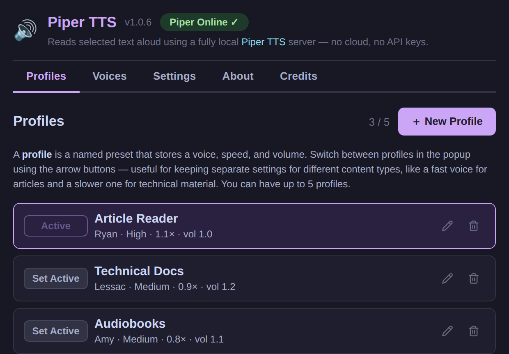

# Piper TTS

A Chrome extension that lets you highlight text on any webpage, right-click it, and have it read aloud using a fully local [Piper TTS](https://github.com/rhasspy/piper) model running on your machine — no cloud, no API keys, no data leaves your computer.

A browser TTS fallback is also built in, so it works instantly with no server setup.

## Screenshots




---

## What's in this repo

```
piper-tts/
├── extension/              Chrome Manifest V3 extension
│   ├── manifest.json
│   ├── background.js       Service worker: context menu, routing
│   ├── offscreen.html/.js  Hidden page that plays Piper audio (MV3 requirement)
│   ├── popup.html/.js/.css Toolbar popup — profile switcher & quick controls
│   ├── options.html/.js/.css Full settings page (profiles, voices, credits)
│   └── icons/
│
└── local-piper-server/     Local Node.js server that calls Piper
    ├── server.js
    ├── package.json
    ├── piper/
    │   ├── piper.exe       ← you download this (see Step 3)
    │   └── voices/
    │       ├── *.onnx      ← you download these (see Step 4)
    │       └── *.onnx.json
    └── output/             Temp WAV files (auto-cleaned)
```

---

## Setup Guide

### Step 1 — Clone or download this repo

```bash
git clone https://github.com/n8watkins/piper-tts.git
cd piper-tts
```

Or download the ZIP from GitHub and extract it.

---

### Step 2 — Load the Chrome extension

1. Open Chrome and navigate to: `chrome://extensions`
2. Enable **Developer mode** (toggle in the top-right corner)
3. Click **Load unpacked**
4. Select the **`extension/`** folder inside this project

You'll see a 🔊 icon appear in your Chrome toolbar.

> **You can stop here** and the extension will work right now using your browser's built-in voice. To get high-quality local neural TTS, continue with steps 3–6.

---

### Step 3 — Download Piper TTS

Piper is a fast, offline text-to-speech engine. This repo is currently configured for the Windows Piper binary:

1. Go to the [Piper releases page](https://github.com/rhasspy/piper/releases/latest)
2. Download `piper_windows_amd64.zip`
3. Extract it — you'll get a folder containing `piper.exe` and some DLL files
4. Copy **all** the extracted files into:
   ```
   local-piper-server/piper/
   ```

After this step your folder should look like:
```
local-piper-server/piper/
├── piper.exe
├── espeak-ng-data/     (comes with the Piper archive)
└── ...other DLLs
```

---

### Step 4 — Download a voice model

Piper uses `.onnx` voice model files. Each voice has two files: a `.onnx` model and a `.onnx.json` config.

1. Go to the [Piper voices on HuggingFace](https://huggingface.co/rhasspy/piper-voices/tree/main/en/en_US)
2. Browse and find a voice you like (e.g. `en_US-ryan-high` or `en_US-amy-medium`)
3. Download **both** files for your chosen voice:
   - `en_US-ryan-high.onnx`
   - `en_US-ryan-high.onnx.json`
4. Place both files in:
   ```
   local-piper-server/piper/voices/
   ```

You can download multiple voices and switch between them in the extension's Settings page.

---

### Step 5 — Start the local server

```bash
cd local-piper-server
npm install        # first time only
npm start
```

You should see:
```
🔊 Piper TTS Local Server
   Running at http://127.0.0.1:5050
```

The server must be running whenever you want to use local TTS.

---

### Step 6 — Verify in Chrome

1. Click the 🔊 icon in your Chrome toolbar
2. The status dot should turn green when the local server is reachable
3. If it stays red/offline, make sure `npm start` is running and check for errors

---

## Usage

**Read text aloud:**
1. Highlight any text on a webpage
2. Right-click → **Read selected text aloud**
3. To stop while audio is playing: right-click anywhere → **Stop reading** (or use the popup)

**Keyboard shortcuts:**
- Read / stop selected text: `Alt+Shift+R`
- Pause / resume: `Alt+Shift+D`
- Stop / exit: `Alt+Shift+E`

You can change these shortcuts in Settings.

**Switch profiles:**
- Click the `‹` / `›` arrows in the popup to cycle between profiles
- Each profile stores a voice + speed + volume setting

**Open Settings:**
- Click the ⚙ gear icon in the popup
- The full settings page opens in a new tab

---

## Settings Page

The settings page (⚙ gear icon) has five tabs:

| Tab | What you can do |
|-----|-----------------|
| **Profiles** | Create, edit, and delete named voice presets (up to 5). Each profile stores a voice, speed, and volume. |
| **Voices** | Browse installed voices, test them, mark favorites (up to 5), or delete them from disk. |
| **Settings** | Toggle the browser TTS fallback when Piper is offline. |
| **About** | See how the extension routes selected text through the local server and offscreen player. |
| **Credits** | Piper credits and links back to this README. |

---

## Features

There is not a separate mode switch. The extension tries the local Piper server first. If Piper is offline and **Browser TTS fallback** is enabled, it uses Chrome's built-in `chrome.tts` voice instead.

| Capability | Browser voice fallback | Local Piper voice |
|------------|------------------------|-------------------|
| Requires local Piper server | ❌ | ✅ |
| Sends text to a hosted API | ❌ | ❌ |
| Voice source | Browser / OS voices | Downloaded Piper `.onnx` voices |
| Voice management in this app | ❌ uses browser defaults | ✅ install, favorite, test, delete |
| Named profiles | ✅ speed + volume | ✅ voice + speed + volume |
| Speed control | ✅ | ✅ |
| Volume control | ✅ capped at browser max | ✅ up to 2× gain |
| Stop reading | ✅ | ✅ |
| Pause / resume | ✅ | ✅ |
| Long selected text | Browser TTS handles playback | Extension chunks text for Piper |
| Offline fallback behavior | This is the fallback engine | Falls back to browser voice when enabled |

---

## How It Works

```
Highlight text → right-click → "Read selected text aloud"
       ↓
background.js (service worker)
       ↓                        ↓
 Piper server online       Server offline + fallback on
       ↓                        ↓
 offscreen.js              chrome.tts.speak()
       ↓
 POST /tts → local-piper-server
       ↓
 Piper.exe → WAV audio
       ↓
 Web Audio API plays it
```

Chrome Manifest V3 service workers cannot play audio directly, so Piper audio playback is routed through an **offscreen document** — a hidden page that can use `new Audio()` normally.

---

## Troubleshooting

**Right-click menu doesn't appear**  
→ Make sure the extension is loaded and enabled at `chrome://extensions`.

**Popup shows "Piper Offline"**  
→ Run `npm start` inside `local-piper-server/`. Check that port 5050 is not blocked.

**No audio / silent playback**  
→ Open Chrome DevTools (F12 → Console) and look for errors. Common causes: no voice model downloaded, wrong voice filename, Piper executable not found.

**Audio sounds wrong or cuts off**  
→ Long text is split into sentence chunks and played sequentially. If one chunk errors, playback stops. Check the console for details.

**Browser voice sounds robotic**  
→ That's your OS's built-in TTS. The Piper server provides much better quality.

---

## Roadmap

- [x] Browser-native TTS (no setup required)
- [x] Local Piper TTS server integration
- [x] Offscreen document audio playback (MV3 compliant)
- [x] Long-text sentence chunking
- [x] Offline browser TTS fallback
- [x] Named profiles (voice + speed + volume presets)
- [x] Settings page (voices, profiles, credits)
- [x] Multiple voice management (install, test, favorite, delete)
- [x] Keyboard shortcut to trigger reading
- [x] Pause / resume support
- [ ] Reading progress indicator in popup
- [ ] Windows tray helper (auto-start server)
- [ ] macOS/Linux Piper server launch script

### Roadmap Plan

**Reading progress indicator**
1. Track total chunks and current chunk in `offscreen.js`.
2. Send progress updates to `background.js` during Piper playback.
3. Expose progress through the existing `get-playback-state` message.
4. Add a compact progress bar to the popup and overlay.
5. For browser fallback playback, show an indeterminate or elapsed-only state because Chrome's browser TTS API does not expose chunk progress.

**Windows tray helper**
1. Add a small tray app that starts/stops `local-piper-server`.
2. Poll `http://127.0.0.1:5050/health` and show online/offline state.
3. Add a startup option for launching the server when Windows signs in.
4. Document install, uninstall, and troubleshooting steps.

**macOS/Linux server support**
1. Make the server resolve `piper.exe` on Windows and `piper` on macOS/Linux.
2. Add environment variables for `PIPER_BIN`, `VOICE_DIR`, and `PORT`.
3. Add platform-specific setup notes and launch scripts.
4. Verify voice download paths and `xdg-open`/`open` folder behavior on each platform.

---

## Credits

- [Piper TTS](https://github.com/rhasspy/piper) — fast, offline neural TTS by rhasspy
- [Piper voices on HuggingFace](https://huggingface.co/rhasspy/piper-voices) — free English voice models  
- Chrome Offscreen Documents API (MV3)

Piper TTS runs locally: the Chrome extension sends selected text to your own
localhost server, which invokes your local Piper executable and installed voice
models. No text is sent to a hosted API by this project.

MIT License — free to use, fork, and share.
